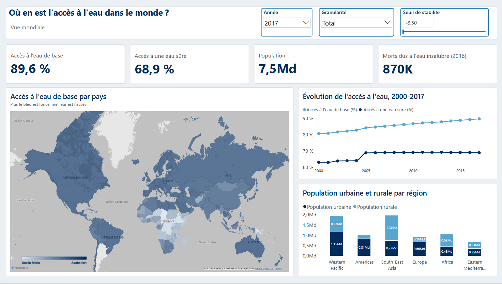
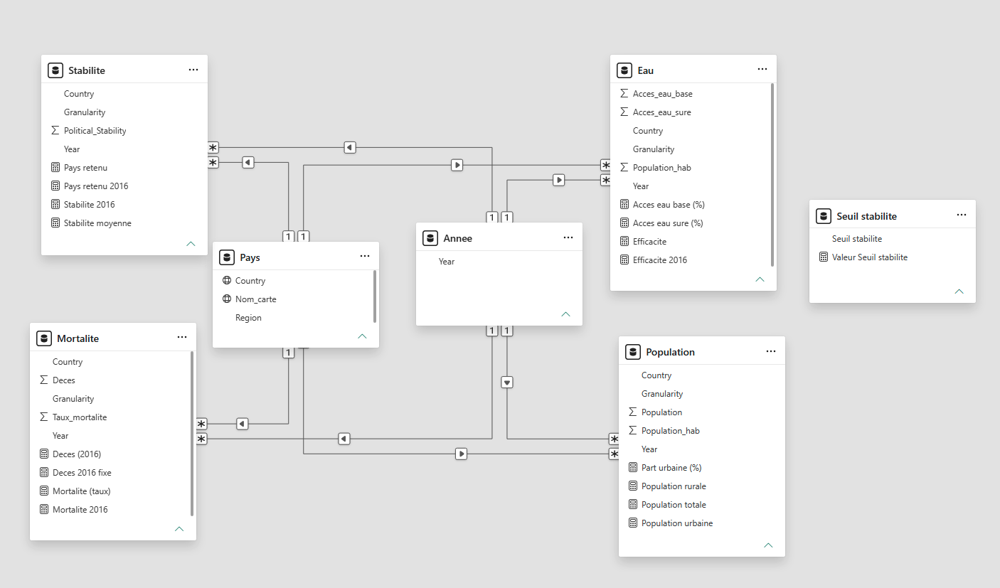
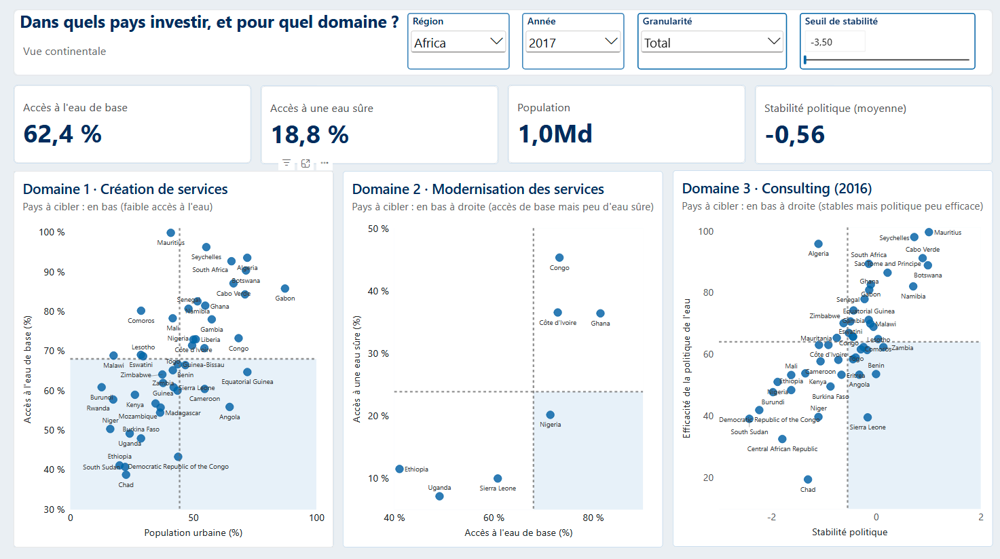
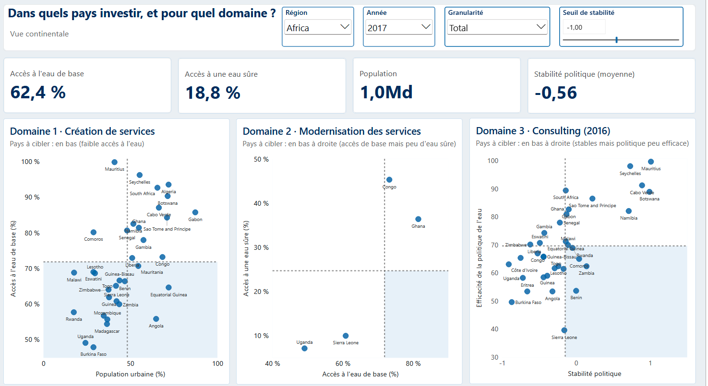
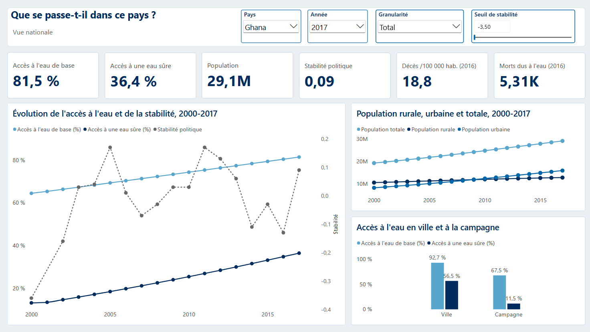

# 💧 Aide à la décision : cibler les investissements d'une ONG dans l'accès à l'eau


En 2017, 89,6 % de la population mondiale a un accès de base à l'eau, mais seulement 68,9 % boit une eau sûre. En 2016, 870 000 personnes sont mortes à cause d'une eau insalubre. J'ai construit un tableau de bord Power BI pour aider une ONG à choisir où placer un financement : **un pays, et un domaine d'action**.



---

## 📖 Contexte

DWFA (cas fictif) est une ONG qui veut donner accès à l'eau potable à tout le monde. Elle a demandé un financement à un bailleur de fonds, et doit dire dans quel pays elle l'utiliserait, sur l'un de ses trois domaines d'expertise :

| Domaine | Ce que fait DWFA | Le croisement demandé |
|---|---|---|
| 1. Création de services | Construire l'accès à l'eau là où il n'existe pas | Accès à l'eau × part de population urbaine |
| 2. Modernisation | Rendre sûre une eau qui arrive déjà | Accès de base × accès à une eau sûre |
| 3. Consulting | Conseiller les gouvernements sur leur politique de l'eau | Efficacité de la politique × stabilité politique |

La demande : trois vues (monde, continent, pays), un nuage de points par domaine, et un filtre réglable pour exclure les pays trop instables politiquement.

---

## 🎯 Ce que j'ai fait

- Écrit le **blueprint** avant d'ouvrir l'outil : 12 visuels répartis sur 3 vues, et 5 filtres
- Nettoyé et relié **5 fichiers** (OMS et FAO) dans **Power Query**, jointure réussie à 99 %
- Construit un **schéma en constellation** : 4 tables de faits qui partagent 2 dimensions, les pays et les années
- Écrit les **mesures DAX** : moyennes pondérées par la population, efficacité de la politique de l'eau, seuil de stabilité réglable
- Rendu le rapport **accessible** : textes de remplacement, ordre de tabulation, valeurs écrites, unités dans les titres
- **Mesuré la vitesse** de chaque visuel avec l'analyseur de performances

---

## 🧹 Le prétraitement

Tout le nettoyage est fait dans Power Query. Il se rejoue à chaque actualisation, rien n'est corrigé à la main.

- **Les décimales** : les fichiers utilisent le point. Je les lis avec les paramètres régionaux Anglais (États-Unis), et je vérifie que chaque pourcentage arrive en nombre. 0 erreur de type.
- **La population** est donnée en milliers : je la multiplie par 1 000.
- **Les noms de pays** ne sont pas écrits pareil d'un fichier à l'autre (« China, mainland », « North Macedonia »). Je les aligne, sinon la jointure les perd.
- **La jointure** eau et population, sur le pays, l'année et la zone (total, urbain, rural) : 99 % des lignes reliées. Le 1 % restant, ce sont des pays qui ont changé de frontières (Soudan et Soudan du Sud, Serbie et Monténégro).
- **Les cases vides sont gardées**, jamais supprimées : 10 % de vides sur l'accès de base, 69 % sur l'eau sûre. Retirer ces lignes aurait fait disparaître des pays entiers des autres graphiques.

---

## 🗂️ Le modèle



Un schéma en constellation : 4 tables de faits (`Eau`, `Population`, `Stabilite`, `Mortalite`) partagent 2 tables de dimensions (`Pays` et `Annee`). Chaque table de faits forme une étoile avec ces deux dimensions, et les 4 étoiles ont le même centre. Les 8 relations partent des dimensions, dans un seul sens. Quand on choisit un pays ou une année, le filtre descend vers toutes les tables de faits.

La table `Annee` est générée en DAX (2000 à 2017). La table `Seuil stabilite`, seule à droite, est un paramètre : c'est elle qui porte le curseur. Elle n'a pas besoin d'être reliée.

---

## 🧮 Les mesures DAX clés

Chacune de ces mesures répond à un piège des données.

### 1. La Chine comptée deux fois

Le fichier de population contient aussi des territoires, et plusieurs lignes pour la Chine (« China », « China, mainland », Hong Kong, Macao, Taiwan). En additionnant tout, la Chine est comptée deux fois. Je ne garde que les pays rattachés à une région, sans écraser les filtres choisis par l'utilisateur : on retombe sur 7,5 milliards en 2017.

```dax
Population totale =
CALCULATE(
    SUM(Population[Population_hab]),
    Population[Granularity] = "Total",
    KEEPFILTERS(NOT ISBLANK(Pays[Region]))
)
```

### 2. Une moyenne qui ment

Un pays d'un million d'habitants à 100 % d'accès, un autre de 99 millions à 50 %. La moyenne simple dit 75 %. La réalité, c'est 50,5 % des gens. Chaque pourcentage compte donc selon le nombre de personnes concernées, et les cases vides sont écartées du calcul.

```dax
Acces eau base (%) =
DIVIDE(
    SUMX(FILTER(Eau, NOT ISBLANK(Eau[Acces_eau_base])), Eau[Acces_eau_base] * Eau[Population_hab]),
    SUMX(FILTER(Eau, NOT ISBLANK(Eau[Acces_eau_base])), Eau[Population_hab])
)
```

### 3. Un indicateur qui n'existait pas

Le domaine 3 demande l'efficacité de la politique de l'eau, et aucun fichier ne la donne. Je l'ai construite à partir de deux chiffres : l'accès et la mortalité. Ils n'ont pas la même unité, et pour la mortalité, plus bas veut dire mieux. Je mets donc la mortalité sur 100 (100 pour le pays qui a le moins de morts, 0 pour celui qui en a le plus), puis je fais la moyenne avec l'accès.

```dax
Efficacite =
VAR acces = [Acces eau base (%)]
VAR mort = [Mortalite (taux)]
VAR mortMax = CALCULATE(MAXX(VALUES(Pays[Country]), [Mortalite (taux)]), ALL(Pays))
VAR mortMin = CALCULATE(MINX(VALUES(Pays[Country]), [Mortalite (taux)]), ALL(Pays))
VAR noteMort = DIVIDE(mortMax - mort, mortMax - mortMin) * 100
RETURN IF(ISBLANK(acces) || ISBLANK(mort), BLANK(), (acces + noteMort) / 2)
```

### 4. Un pays du mauvais côté du seuil

La mortalité n'existe que pour 2016. Le nuage du domaine 3 est donc figé sur cette année, quelle que soit l'année choisie dans le segment. Si le curseur de stabilité filtrait sur l'année du segment, un pays pouvait rester affiché à gauche du seuil : filtré sur sa stabilité 2017, mais placé selon celle de 2016. J'ai donc figé le filtre sur la même année que l'axe.

```dax
Stabilite 2016 =
CALCULATE([Stabilite moyenne], REMOVEFILTERS(Annee), Annee[Year] = 2016)

Pays retenu 2016 =
IF(ISBLANK([Stabilite 2016]), 0,
    IF([Stabilite 2016] >= [Valeur Seuil stabilite], 1, 0))
```

---

## 🔍 Résultats

### 1️⃣ L'Afrique est la région la plus en retard



62,4 % d'accès de base et 18,8 % d'eau sûre en 2017, contre 89,6 % et 68,9 % pour le monde. Sur chaque nuage, les lignes en pointillés sont les moyennes, et la zone bleue montre où chercher.

### 2️⃣ Un pays par domaine

Avec le seuil de stabilité au plus bas :

- **Domaine 1, le Tchad** : l'accès de base le plus faible, et une population surtout rurale, donc des réseaux longs à construire
- **Domaine 2, le Nigeria** : le seul pays dans la zone cible, avec un accès de base correct mais peu d'eau sûre
- **Domaine 3, la Sierra Leone** : un pays stable (-0,16), mais une politique de l'eau peu efficace (39,6 sur 100)

Le **Niger** montre l'inverse : le besoin est énorme, mais son instabilité rend le consulting risqué.

### 3️⃣ Le seuil de stabilité change la recommandation



Avec le curseur à -1, les pays les plus instables sortent des trois nuages, dont le Tchad et le Nigeria. Le Burkina Faso prend la place du Tchad, plus aucun pays n'est dans la zone du domaine 2, et la Sierra Leone reste. C'est au bailleur de dire quel risque il accepte : le tableau de bord le montre en direct.

### 4️⃣ Même dans un pays mieux équipé, la campagne reste loin derrière



Le Ghana est à 81,5 % d'accès de base en 2017, bien au-dessus de la moyenne africaine. Mais en ville, 56,5 % des habitants boivent une eau sûre, contre 11,5 % à la campagne.

---

## ♿ Accessibilité

- Une seule palette de bleus : plus c'est foncé, plus la valeur est haute
- La couleur ne porte jamais seule l'information : valeurs écrites sur les barres et dans les chiffres clés
- Chaque point des nuages porte le nom de son pays
- Un texte de remplacement pour chaque visuel, lu par les lecteurs d'écran
- La touche Tab suit l'ordre de lecture de chaque page
- Chaque page pose sa question dans son titre, et les unités sont écrites (« Décès /100 000 hab. »)

---

## ⚡ Vitesse d'affichage

Relevé de l'analyseur de performances sur les 3 pages : **66 ms de calcul DAX en moyenne, 151 ms au pire**, et chaque visuel affiché en **moins de 1,2 seconde**. Le reste du temps, c'est le dessin, surtout pour les nuages de points avec les noms des pays.

Cette vitesse vient du modèle : dimensions partagées, relations dans un seul sens, colonnes au bon type, et des mesures plutôt que des colonnes calculées.

---

## 🔎 Points de vigilance sur les données

- **7 pays africains sur 47** ont une donnée « eau sûre » en 2017 : le domaine 2 repose sur peu de points
- La **mortalité** n'existe que pour 2016 : le domaine 3 se juge sur une seule année
- La courbe mondiale de l'eau sûre fait un **saut en 2005** : cette année-là, les États-Unis et la Pologne entrent dans les données, et leur poids fait monter la moyenne
- Certains pays, comme **Madagascar**, n'ont aucune donnée d'eau sûre

Pour aller plus loin, je recommande de compléter l'eau sûre avec les données du programme commun OMS et UNICEF ([washdata.org](https://washdata.org)).

---

## 📋 Le blueprint

Le document qui a fixé les indicateurs de chaque vue avant la construction : [partie 1](captures/06-blueprint-1.png) (vues mondiale et continentale) et [partie 2](captures/07-blueprint-2.png) (vue nationale et filtres).

---

## 🛠️ Technologies utilisées

Power BI Desktop · Power Query · DAX · schéma en constellation · paramètre de simulation (seuil réglable) · carte choroplèthe · nuages de points avec lignes de moyenne · analyseur de performances

---

## 🚀 Ouvrir le rapport

Le fichier `.pbix` s'ouvre avec [Power BI Desktop](https://powerbi.microsoft.com/desktop/), gratuit, sous Windows.

```
1. Télécharger acces-eau-potable-dwfa.pbix
2. L'ouvrir dans Power BI Desktop
3. Passer d'une page à l'autre avec les onglets Monde, Région et Pays
```

Les données sont embarquées dans le fichier. Pour voir le seuil en action : page Région, bouger le curseur « Seuil de stabilité ».

---

## 📂 Structure du dépôt

```
captures/                      les 3 pages, le modèle, le seuil en action, le blueprint
acces-eau-potable-dwfa.pbix    le rapport complet, données embarquées
```

---

## 📈 Compétences démontrées

### Préparation des données
- ✅ 5 sources nettoyées et reliées dans Power Query, étapes rejouables à l'actualisation
- ✅ Noms de pays harmonisés avant la jointure, 99 % des lignes reliées, écart expliqué
- ✅ Cases vides gardées et chiffrées plutôt que supprimées

### Modélisation
- ✅ Schéma en constellation (4 tables de faits, 2 dimensions partagées) à partir de fichiers plats, table des années générée en DAX
- ✅ Moyennes pondérées par la population, pour qu'un grand pays pèse plus qu'un petit
- ✅ Indicateur composite (efficacité de la politique de l'eau) construit à partir de deux mesures
- ✅ Paramètre réglable qui filtre la carte et trois nuages de points à la fois
- ✅ Contexte de filtre maîtrisé : `KEEPFILTERS`, `REMOVEFILTERS`, `ALL`, mesures figées sur une année

### Restitution
- ✅ Un besoin, un indicateur, un graphique : blueprint écrit avant la construction
- ✅ Trois vues du plus large au plus précis : monde, continent, pays
- ✅ Accessibilité : palette unique, textes de remplacement, ordre de tabulation, unités écrites
- ✅ Vitesse mesurée visuel par visuel, pas supposée
- ✅ Recommandation argumentée et sourcée

---

## 📧 Contact

**Helton Dos Santos Moreira**
Data Analyst / Data Engineer | 10 ans d'expérience business (retail et e-commerce)

- 📧 Email : heltonmail8@gmail.com
- 💼 LinkedIn : [in/helton-dsm-data](https://linkedin.com/in/helton-dsm-data)
- 🐙 GitHub : [Heltondsm](https://github.com/Heltondsm)

---

## 🔗 Autres projets

- [Portefeuille de 104 projets dans 52 pays](https://github.com/Heltondsm/powerbi-portefeuille-projets-rls), Power BI, sécurité au niveau des lignes sur 3 rôles
- [Tendances du streaming musical](https://github.com/Heltondsm/analyse-streaming-musical), 114 000 morceaux, tests statistiques et calendrier de sortie
- [Pipeline dbt : profils sociodémographiques](https://github.com/Heltondsm/dbt-demographics-pipeline), Snowflake et DuckDB, 26 tests, reproductible en une commande
- [Pipeline de veille du marché de l'emploi](https://github.com/Heltondsm/job-market-pipeline), APIs France Travail et INSEE Sirene, 787 offres et 1 135 entreprises en 14 secondes

---

**Projet réalisé en septembre 2026**
